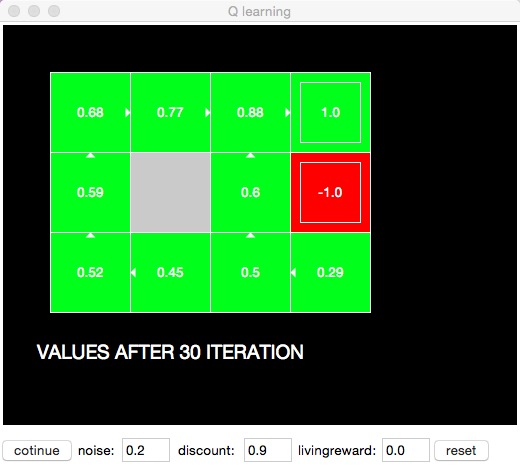

#QLearning
 simple examples using Q-Learning algorithm , implemented using Python
 
##1.GridWorld
 this sample create a small grid world, where an agent should explore to reach to the end on the map, meanwhile, getting the max reward. 
 following is the demo:
 

###HOW TO USE
 just run the Graphics.py

      python Graphics.py
 